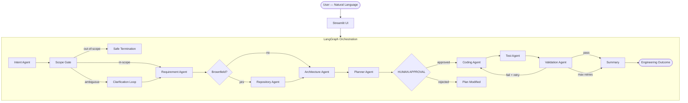

# ⚙️ AgentForge

> **Agentic SDLC Workflow Automation Platform**
>
> Give it a requirement in plain English. It understands, plans, asks for your approval, builds, tests, and validates — automatically.

[](https://github.com/your-username/agentforge/actions)
[](https://www.python.org/downloads/)
[](LICENSE)

---

## What Is AgentForge?

AgentForge is a prototype agentic software engineering system that transforms a natural-language software requirement into a reviewable engineering outcome.

**The interaction is simple:**

> *"Add analytics to my URL shortener so I can see clicks per day."*

AgentForge takes it from there:

1. **Understands** the requirement (brownfield enhancement to URL shortener)
2. **Analyzes** the existing codebase
3. **Designs** the architecture and decomposes tasks
4. **Asks for your approval** — showing the full plan before writing a line of code
5. **Implements** the change with targeted code modifications
6. **Tests** the implementation
7. **Validates** results with actual evidence
8. **Produces** a structured engineering outcome with diff, test results, and risks

**You never select a workflow type.** The system figures it out.

---

## Architecture



---

## Agent Responsibilities

| Agent | Responsibility |
|-------|---------------|
| **Intent Agent** | Classifies user intent: greenfield / brownfield / bugfix / refactor / ambiguous / out-of-scope |
| **Requirement Agent** | Normalizes requirement, extracts functional/non-functional requirements, assumptions, acceptance criteria |
| **Repository Agent** | Inspects existing codebase using deterministic tools (AST, file listing, git log) |
| **Architecture Agent** | Designs solution architecture, API contracts, data model |
| **Planner Agent** | Generates dependency-aware task DAG with risks and validation strategy |
| **Coding Agent** | Generates new code (greenfield) or modifies existing files (brownfield/bugfix/refactor) |
| **Test Agent** | Generates and runs pytest test suites |
| **Validation Agent** | Validates outputs with actual execution evidence (syntax check, test run, requirement matching) |

---

## LangGraph Orchestration

AgentForge uses **LangGraph** as its orchestration framework. Key features used:

- **Conditional routing** — workflow path determined by structured state, not hard-coded sequences
- **Human-in-the-loop** — `interrupt()` pauses execution at the approval gate
- **Checkpointing** — SQLite-backed state persistence allows workflow resumption
- **Retry loops** — failed validation triggers remediation (max 2 attempts)
- **Structured state** — all agents communicate via `EngineeringState` TypedDict

---

## URL Shortener Reference Application

The mandatory reference app is a production-quality FastAPI URL shortener.

### APIs

| Method | Path | Description |
|--------|------|-------------|
| `POST` | `/api/v1/urls` | Create a short URL |
| `GET` | `/{short_code}` | Redirect to original URL |
| `GET` | `/api/v1/urls/{id}` | Get URL details |
| `GET` | `/api/v1/urls/{id}/analytics` | Click analytics |
| `DELETE` | `/api/v1/urls/{id}` | Deactivate URL |
| `GET` | `/health` | Health check |
| `GET` | `/docs` | OpenAPI documentation |

### Key Design Decisions

**Deterministic Short Codes:** Short codes are generated using SHA-256 hash of the original URL encoded in base62. Same URL always produces the same short code. This eliminates the "different short code after restart" bug.

**Redis Cache:** Redirect lookups check Redis first (cache hit → immediate redirect). On cache miss, query PostgreSQL and populate cache. Reduces database load for popular URLs.

**Redirect Flow:**
```
GET /{short_code}
        ↓
     Redis
        ↓
  ┌────────────┐
  │    HIT     │    MISS
  │            ↓
  │       PostgreSQL
  │            ↓
  │       Set Redis
  │            ↓
  └──────→ 302 Redirect
```

### Data Model

```sql
-- URL table
CREATE TABLE urls (
    id          INTEGER PRIMARY KEY AUTOINCREMENT,
    original_url VARCHAR(2048) NOT NULL,
    short_code   VARCHAR(20) UNIQUE NOT NULL,
    created_at   DATETIME DEFAULT CURRENT_TIMESTAMP,
    expires_at   DATETIME,
    is_active    BOOLEAN DEFAULT TRUE
);

-- Click analytics table
CREATE TABLE clicks (
    id          INTEGER PRIMARY KEY AUTOINCREMENT,
    url_id      INTEGER NOT NULL REFERENCES urls(id),
    clicked_at  DATETIME DEFAULT CURRENT_TIMESTAMP,
    user_agent  VARCHAR(512),
    referrer    VARCHAR(2048)
);
```

---

## Setup & Running

### Prerequisites

- Python 3.11+
- pip
- Git
- (Optional) Docker for PostgreSQL + Redis

### Quick Start — SQLite Mode (Recommended for Demo)

```bash
# 1. Clone the repository
git clone https://github.com/your-username/agentforge.git
cd agentforge

# 2. Create virtual environment
python -m venv .venv
.venv\Scripts\activate   # Windows
# source .venv/bin/activate  # macOS/Linux

# 3. Install dependencies
pip install -e ".[dev]"

# 4. Configure environment
copy .env.example .env
# Edit .env — set your LLM_API_KEY

# 5. Run the AgentForge UI
streamlit run ui/streamlit_app.py
```

### Run the URL Shortener Standalone

```bash
# SQLite mode (no Docker)
uvicorn reference_app.url_shortener.main:app --reload --port 8000

# Visit: http://localhost:8000/docs
```

### With Docker (PostgreSQL + Redis)

```bash
# Start infrastructure
docker-compose up -d

# URL shortener will be at http://localhost:8000
```

---

## Demo Instructions

### Demo 1 — Greenfield
Enter: `"Build a scalable URL shortener with APIs, persistence and analytics."`

Watch AgentForge:
- Classify as GREENFIELD (new build)
- Design FastAPI + SQLite + Redis architecture
- Create 6-task dependency DAG
- Wait for your approval
- Generate complete working application
- Run tests, show outcome

### Demo 2 — Brownfield Enhancement
Enter: `"Add rate limiting to the URL creation endpoint."`

Watch AgentForge:
- Classify as BROWNFIELD
- Inspect existing `reference_app/url_shortener/` codebase
- Identify impacted API routes and middleware
- Show proposed changes
- After approval: modify files, show git diff

### Demo 3 — Bug Fix
Enter: `"Sometimes the same URL gets a different short code after restarting the application. Fix it."`

Watch AgentForge:
- Classify as BUG FIX
- Locate short-code generation code
- Identify root cause (random vs. deterministic)
- Propose fix: SHA-256 hash → base62 encoding
- Add regression test
- After approval: implement and validate

### Demo 4 — Refactoring
Enter: `"Refactor the URL service because it is becoming difficult to maintain."`

Watch AgentForge:
- Classify as REFACTOR
- Establish test baseline
- Identify code organization issues
- Propose safe refactoring (extract analytics service)
- After approval: refactor + verify behavior unchanged

### Demo 5 — Ambiguous Requirement
Enter: `"Make the URL shortener scalable."`

Watch AgentForge:
- Detect AMBIGUITY
- Ask clarifying question
- Proceed only after clear answer

### Demo 6 — Out of Scope
Enter: `"Build me a payroll management system."`

Watch AgentForge:
- Detect OUT_OF_SCOPE
- Respond gracefully without starting expensive agents
- Ask if this might be a URL shortener requirement

---

## Running Tests

```bash
# All unit tests (no API key required)
pytest tests/unit/ -v

# URL shortener tests
pytest reference_app/url_shortener/tests/ -v

# All tests
pytest tests/ -v

# With coverage
pytest tests/ --cov=app --cov-report=html
```

---

## LLM Configuration

Configure in `.env`:

```env
LLM_PROVIDER=gemini          # gemini | openai | anthropic | openai_compatible
LLM_MODEL=gemini-1.5-flash   # model name
LLM_API_KEY=your-key-here
LLM_PLANNER_MODEL=gemini-1.5-pro  # smarter model for planning
```

For OpenAI-compatible servers (vLLM, LM Studio):
```env
LLM_PROVIDER=openai_compatible
LLM_BASE_URL=http://localhost:11434/v1
LLM_API_KEY=not-needed
```

---

## Known Limitations & Trade-offs

| Limitation | Reason | Future Improvement |
|------------|--------|-------------------|
| Gemini API key needed | LLM calls required for agents | Support local models via ollama |
| SQLite by default | Simpler setup for demo | Full PostgreSQL mode via Docker |
| No real sandbox isolation | Prototype scope | Docker-based workspace isolation |
| Brownfield changes written to disk | Demo simplicity | Git branch + PR workflow |
| Validation requires test execution | Need correct test env | CI integration |
| Analytics stored in PostgreSQL | Prototype simplicity | Kafka + async pipeline at scale |

---

## Architecture Decision Records

See [docs/decisions.md](docs/decisions.md) for detailed ADRs covering:
- Why LangGraph
- Why deterministic repository tools
- Why SQLite default
- Why not Kafka
- Why Streamlit

---

## Project Structure

```
agentforge/
├── app/
│   ├── agents/          # All AI agents
│   ├── graph/           # LangGraph state + workflow
│   ├── llm/             # LLM provider abstraction
│   └── tools/           # Deterministic repo tools
├── ui/
│   └── streamlit_app.py # Full Streamlit frontend
├── reference_app/
│   └── url_shortener/   # Runnable FastAPI URL shortener
├── demo/                # Demo scenario inputs
├── docs/                # Architecture docs
├── tests/               # Unit + Integration tests
└── .github/workflows/   # CI pipeline
```

---

## License

MIT License — see [LICENSE](LICENSE)
